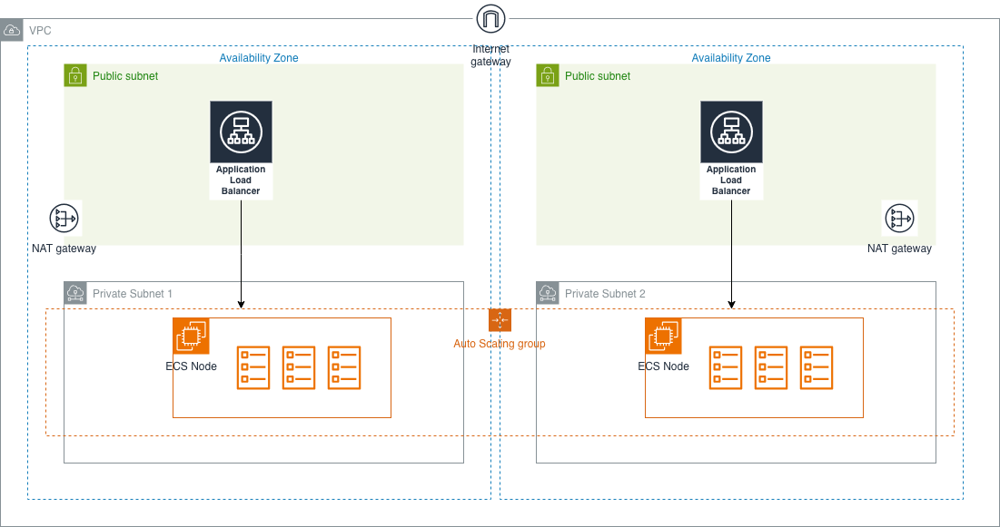

# Elastic Container Service (ECS) Lab

## About

Elastic Container Service (ECS) Lab. This deploys a service `echo-server-service` which contains the [ealen/echo-server](https://hub.docker.com/r/ealen/echo-server) container.



Verify communication between ALB/EC2:

```bash
curl http://<lb-dns-name>
```

Output:

```text
<h1>Hello from ip-10-10-10-201.ap-southeast-5.compute.internal</h1>
```

Verify communication between ALB/ECS Service:

```bash
curl http://<lb-dns-name>/echo
```

Output:

```text
curl -s "ecs-lb-1578488677.ap-southeast-5.elb.amazonaws.com/echo/some/path?param=1" | jq

{
  "host": {
    "hostname": "ecs-lb-1578488677.ap-southeast-5.elb.amazonaws.com",
    "ip": "::ffff:10.10.10.52",
    "ips": []
  },
  ... truncated ...
}
```

## Running/Deploying

```bash
terraform init
terraform apply
```

Sample Output:

```text
Apply complete! Resources: 1 added, 0 changed, 0 destroyed.

Outputs:

bastion_instance_id = "i-0828fffb1f785693b"
bastion_private_ip = "10.10.10.155"
lb_url = "ecs-lb-1578488677.ap-southeast-5.elb.amazonaws.com"
nat_ips = tolist([
  "56.68.32.144",
  "56.69.23.19",
])
node_launchtemplate_version = 1
```

## Increasing EC2 ENI density

Since we use `awsvpc` networking mode, each task gets its own ENI. EC2 instances have a limited number of ENIs per instance family, which caps how many `awsvpc` tasks can land on each Container Instance.

ENI trunking raises that cap. **For trunking to take effect on EC2-backed container instances, the `awsvpcTrunking` setting must be enabled for the instance's IAM role.** The instance role only ever sees an **account-wide default (the `:root` scope)** — it does *not* inherit a principal-scoped setting applied to a human user.

> ⚠️ **Trap:** `list-account-settings --effective-settings` resolves the setting for the **calling principal** (you, the human) — **not the instance role**. If you enable trunking with the principal-scoped command (below, ❌), this check will show `enabled` while the instances still register with trunking disabled.

### 1. Enable it — account-wide (the only command that helps instances)

```bash
aws ecs put-account-setting-default \
  --name awsvpcTrunking \
  --value enabled \
  --region <region>
```

### 2. Verify the scope is `:root` (not a human principal)

```bash
aws ecs list-account-settings --effective-settings --region <region> \
  --query 'settings[?name==`awsvpcTrunking`]'
```

Check the returned `principalArn`:

- `arn:aws:iam::<acct>:root` → ✅ account-wide; applies to the instance role
- `arn:aws:iam::<acct>:user/<you>` → ⚠️ principal-scoped; **does NOT apply to instances**

> Only the root user can list another principal's settings. If you're unsure whether the `:root` default exists, just run `put-account-setting-default` again — its response echoing `:root` is authoritative.

### 3. Refresh the ASG

Trunking is applied **at container-instance registration time**, so running instances never pick it up retroactively. Replace them:

```bash
aws autoscaling start-instance-refresh \
  --auto-scaling-group-name <asg-name> \
  --region <region>
```

### 4. Confirm it worked (definitive, principal-agnostic)

The most reliable check is an **EC2** one — look for a `trunk` ENI. It does not depend on which IAM principal you're authenticated as:

```bash
aws ec2 describe-network-interfaces --region <region> \
  --filters "Name=interface-type,Values=trunk" \
  --query 'NetworkInterfaces[*].{eni:NetworkInterfaceId, instance:Attachment.InstanceId}' \
  --output table
```

Expect one `trunk` ENI per node. The equivalent ECS-side attribute:

```shell
aws ecs list-attributes \
  --target-type container-instance \
  --attribute-name ecs.awsvpc-trunk-id \
  --cluster <cluster name> \
  --region <region>
```

### ❌ Don't use the principal-scoped command for this

```bash
# Scopes the setting to YOUR principal only. The instance role never sees it,
# so trunking will NOT take effect on EC2 nodes.
aws ecs put-account-setting --name awsvpcTrunking --value enabled --region <region>
```

In all cases the `region` is important — account settings are per-region.

Also see: [Supported instances for increased ENIs](https://docs.aws.amazon.com/AmazonECS/latest/developerguide/eni-trunking-supported-instance-types.html)